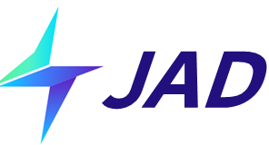

<div align="center">

</div>


## Introduction (介绍)

JAD, namely Jittor Autonomous Driving, is an open-source repository for autonomous driving based on [Jittor](https://github.com/Jittor/jittor). It covers the state-of-the-art of autonomous driving methods in perception, prediction and end-to-end planning.

JAD是一个基于Jittor国产深度学习框架的自动驾驶库。JAD涵盖了最前沿的自动驾驶感知、预测、端到端决策系列算法的实现与预训练权重。

<div><video controls src="https://github.com/OpenDriveLab/UniAD/assets/48089846/bcf685e4-2471-450e-8b77-e028a46bd0f7" muted="false"></video></div>

## Model Zoo (模型仓库)
<b>:heavy_check_mark:Supported（已支持）  :clock3:Doing（正在开发） :heavy_plus_sign:TODO （待办）</b>

### Perception（感知）

- 3D Object Detection （3D 目标检测）

:heavy_check_mark:Supported [BEVFormer](https://arxiv.org/abs/2203.17270) in [3D-Perception/BEVFormer](3D-Perception/BEVFormer)

BEVFormer is a state-of-the-art Transformer based multi-view image encoder, designed for 3D perception, which is selected as one of [ECCV 2022 Top-10 Influential Papers](https://www.paperdigest.org/2023/01/most-influential-eccv-papers-2023-01/) and [the 100 most cited AI papers in 2022](https://www.zeta-alpha.com/post/must-read-the-100-most-cited-ai-papers-in-2022).

BEVFormer是目前最前沿的基于Transformer的多视角图片融合3D感知方案。BEVFormer是ECCV 2022最具影响力的论文之一，是2022年被引前100的AI论文。

<div><video controls src="https://user-images.githubusercontent.com/27915819/161392594-fc0082f7-5c37-4919-830a-2dd423c1d025.mp4" muted="false"></video></div>

- Online Mapping （在线建图）

:clock3:Doing [MapTR]https://arxiv.org/abs/2208.14437)

### Prediction（预测）

- Motion Prediction (轨迹预测)

:heavy_check_mark:Supported [MTR](https://arxiv.org/abs/2209.13508) in [Motion-Prediction/MTR](Motion-Prediction/MTR)

MTR is a state-of-the-art Transformer based motion prediction method. It is the oral presentation of NeurIPS 2022 and its variants have dominated the leaderboard of Waymo Motion, Waymo Interactive, and Waymo Sim Agent. It is also widely used in industry.

MTR是前沿的基于Transformer的预测算法，获NeurIPS 2022上口头汇报的荣誉。MTR及其变体是Waymo Motion, Waymo Interactive, and Waymo Sim Agent等系列榜单上性能最好的算法。MTR也广泛被工业界采用。


### Planning (规控)

- End-to-End Autonomous Driving (端到端自动驾驶)

:heavy_check_mark:Supported [UniAD](https://arxiv.org/abs/2212.10156) in [E2E-AD/UniAD](E2E-AD/UniAD).

UniAD is a state-of-the-art Transformed based end-to-end autonomous driving methods, which won the IEEE CVPR 2023 Best Paper Award. UniAD has a large impact both in academia and industry, including the recent rollout to customers by Tesla in FSD V12. 

UniAD是前沿的基于Transformer的端到端自动驾驶算法，获得了CVPR 2023最佳论文。UniAD在学术界与工业界都有着巨大的影响力，包括特斯拉最新的FSD V12采用了端到端自动驾驶方案。

<div><video controls src="https://github.com/OpenDriveLab/UniAD/assets/48089846/bcf685e4-2471-450e-8b77-e028a46bd0f7" muted="false"></video></div>

## Contact Us （联系我们）
Website: http://cg.cs.tsinghua.edu.cn/jittor/

Email: jittor@qq.com & yanjunchi@sjtu.edu.cn

File an issue: https://github.com/Jittor/JAD/issues

QQ Group: 761222083


## Team （团队）

JAD is currently maintained by [SJTU-ReThinkLab](https://thinklab.sjtu.edu.cn/) with the support from Tsinghua Jittor team and [CSCG Group](https://cg.cs.tsinghua.edu.cn/).

Feel free to request support for new models and contribute to JAD. We are thrilled to co-build the Jittor + Autonomous Driving ecosystem and grow together. 

JAD是由上海交通大学ReThinkLab维护，清华大学计图团队与CSCG组提供了技术支持。

欢迎提出希望得到支持的模型以及贡献自己的模型。我们很高兴能与社区一起共建国产深度学习框架Jittor + 自动驾驶的生态，共同成长。


## Citation （引用）

```
@article{hu2020jittor,
  title={Jittor: a novel deep learning framework with meta-operators and unified graph execution},
  author={Hu, Shi-Min and Liang, Dun and Yang, Guo-Ye and Yang, Guo-Wei and Zhou, Wen-Yang},
  journal={Science China Information Sciences},
  volume={63},
  number={222103},
  pages={1--21},
  year={2020}
}
```
